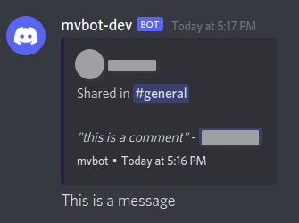

# mvbot

A simple bot to move messages from one discord channel to another.

[Invite mvbot](https://discordapp.com/api/oauth2/authorize?client_id=706927667043237928&permissions=125952&scope=bot)

Syntax:
```
!mv <message-id> <target-channel> ["reason"]
```
The three arguments are as follows:
  - *message-id*: The Message Link (right-click -> Copy Message Link) or Message ID. Note:  You will need to [enable developer mode](https://discordia.me/en/developer-mode) to use Message ID.
  - *target-channel*: Channels can be referenced by the standard #<channel-name>.
  - *reason (optional)*: Can be left blank, or provide a reason why the message is being moved. Must be enclosed in double-quotes.
  
  Only users with the *MANAGE_MESSAGES* permission will be able to invoke the bot.
  
  ***mvbot*** also requires the following permissions on every channel to/from which messages should be movable.
  
  General permissions:
  - View Channels
  
  Text Permissions:
  - Send messages
  - Manage messages
  - Embed links
  - Attach files
  - Read message history
  
  

